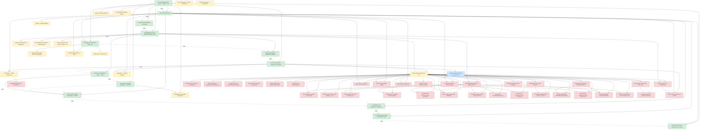

```mermaid
graph TD
    transpiler_1["01 Transpiler-Pipeline (Lexer → Parser → AS"]
    style transpiler_1 fill:#d4edda,stroke:#28a745
    routing_1["02 File-based Routing"]
    style routing_1 fill:#d4edda,stroke:#28a745
    layout_1["03 Layout-System ({#slot} + {#head})"]
    style layout_1 fill:#d4edda,stroke:#28a745
    middleware_1["04 Middleware-System (RequestLogging + Redi"]
    style middleware_1 fill:#d4edda,stroke:#28a745
    cli_1["05 dreego CLI (generate, build, run)"]
    style cli_1 fill:#d4edda,stroke:#28a745
    config_1["06 dreego/config.json (Redirects, Rewrites,"]
    style config_1 fill:#d4edda,stroke:#28a745
    context_refactoring_1["07 Context Interface + SSRContext (map[stri"]
    style context_refactoring_1 fill:#d4edda,stroke:#28a745
    recovery_1["08 Recovery-Middleware (Panic → 500)"]
    style recovery_1 fill:#d4edda,stroke:#28a745
    xss_1["09 XSS Auto-Escaping ({variable} → html.Esc"]
    style xss_1 fill:#d4edda,stroke:#28a745
    error_pages_1["10 Custom Error-Pages (404.dreego + 500.dre"]
    style error_pages_1 fill:#d4edda,stroke:#28a745
    bracket_routes_1["11 [id] Brackets für dynamische Segmente"]
    style bracket_routes_1 fill:#d4edda,stroke:#28a745
    route_groups_1["12 (group)/ Route Groups (unsichtbar in URL"]
    style route_groups_1 fill:#d4edda,stroke:#28a745
    flat_gen_1["13 Flat Gen-Package (gen/routes.go statt pe"]
    style flat_gen_1 fill:#d4edda,stroke:#28a745
    api_json_1["API-Routen + JSON Responses"]
    style api_json_1 fill:#fff3cd,stroke:#ffc107
    compression_1["Gzip/Brotli Compression Middleware"]
    style compression_1 fill:#fff3cd,stroke:#ffc107
    deployment_1["Deployment-Strategie (Docker, Single-Bin"]
    style deployment_1 fill:#fff3cd,stroke:#ffc107
    documentation_1["docs.dreego.dev + Tutorial + Examples"]
    style documentation_1 fill:#fff3cd,stroke:#ffc107
    dreegotest_1["dreegotest — Testing-Package"]
    style dreegotest_1 fill:#fff3cd,stroke:#ffc107
    each_loop_1["{#each} mit $loop-Variable"]
    style each_loop_1 fill:#fff3cd,stroke:#ffc107
    health_checks_1["/health + /ready Endpoints"]
    style health_checks_1 fill:#fff3cd,stroke:#ffc107
    hot_reload_1["Hot Reload (Dev-Server + SSE)"]
    style hot_reload_1 fill:#fff3cd,stroke:#ffc107
    observability_1["Observability (Prometheus, OpenTelemetry"]
    style observability_1 fill:#fff3cd,stroke:#ffc107
    plugin_interface_1["Plugin-Interface (Frozen for v1)"]
    style plugin_interface_1 fill:#fff3cd,stroke:#ffc107
    scaffolding_1["dreego new + Generatoren"]
    style scaffolding_1 fill:#fff3cd,stroke:#ffc107
    security_headers_1["Security-Header (CSP, HSTS, X-Frame, X-C"]
    style security_headers_1 fill:#fff3cd,stroke:#ffc107
    static_assets_1["Static Assets (static/ → embed.FS)"]
    style static_assets_1 fill:#fff3cd,stroke:#ffc107
    template_filters_1["Template-Filter ({var|raw}, {var|upper})"]
    style template_filters_1 fill:#fff3cd,stroke:#ffc107
    verbatim_1["{#verbatim} Block (Raw-Output)"]
    style verbatim_1 fill:#fff3cd,stroke:#ffc107
    session_1["Session-Interface (Cookie Store im Core)"]
    style session_1 fill:#cce5ff,stroke:#0d6efd
    addon_ecosystem_1["Addon-Ökosystem (auth, ui, admin, db)"]
    style addon_ecosystem_1 fill:#f8d7da,stroke:#dc3545
    api_swagger_1["Swagger/OpenAPI Auto-Generation"]
    style api_swagger_1 fill:#f8d7da,stroke:#dc3545
    cache_interface_1["Caching Interface (Memory, Redis)"]
    style cache_interface_1 fill:#f8d7da,stroke:#dc3545
    components_1["Component-System ({#use}, props)"]
    style components_1 fill:#f8d7da,stroke:#dc3545
    csrf_1["CSRF-Schutz (Core-Conditional)"]
    style csrf_1 fill:#f8d7da,stroke:#dc3545
    ddos_protection_1["DDoS-Schutz (PoW + Rate-Limiting) — Plug"]
    style ddos_protection_1 fill:#f8d7da,stroke:#dc3545
    devtools_1["DevTools (LSP, VS Code, CLI-Niceties)"]
    style devtools_1 fill:#f8d7da,stroke:#dc3545
    dreego_analytics_1["dreego-analytics (Privacy-friendly, Serv"]
    style dreego_analytics_1 fill:#f8d7da,stroke:#dc3545
    dreego_cache_1["dreego-cache (Caching: Memory, Redis)"]
    style dreego_cache_1 fill:#f8d7da,stroke:#dc3545
    dreego_charts_1["dreego-charts (Chart.js/Canvas Component"]
    style dreego_charts_1 fill:#f8d7da,stroke:#dc3545
    dreego_cluster_1["dreego-cluster (Multi-Node, Distributed "]
    style dreego_cluster_1 fill:#f8d7da,stroke:#dc3545
    dreego_features_1["dreego-features (Feature-Flags, A/B-Test"]
    style dreego_features_1 fill:#f8d7da,stroke:#dc3545
    dreego_i18n_1["dreego-i18n (Internationalisierung)"]
    style dreego_i18n_1 fill:#f8d7da,stroke:#dc3545
    dreego_icons_1["dreego-icons (Lucide/Heroicons Component"]
    style dreego_icons_1 fill:#f8d7da,stroke:#dc3545
    dreego_jobs_1["dreego-jobs (Background-Jobs, Cron, Queu"]
    style dreego_jobs_1 fill:#f8d7da,stroke:#dc3545
    dreego_mail_1["dreego-mail (E-Mail SMTP/Resend/Postmark"]
    style dreego_mail_1 fill:#f8d7da,stroke:#dc3545
    dreego_map_1["dreego-map (MapLibre/Leaflet Components)"]
    style dreego_map_1 fill:#f8d7da,stroke:#dc3545
    dreego_markdown_1["dreego-markdown (Markdown-Rendering, Fro"]
    style dreego_markdown_1 fill:#f8d7da,stroke:#dc3545
    dreego_notify_1["dreego-notify (Multi-Channel Notificatio"]
    style dreego_notify_1 fill:#f8d7da,stroke:#dc3545
    dreego_pdf_1["dreego-pdf (PDF-Generierung aus HTML)"]
    style dreego_pdf_1 fill:#f8d7da,stroke:#dc3545
    dreego_polar_1["dreego-polar (Payments via Polar.sh)"]
    style dreego_polar_1 fill:#f8d7da,stroke:#dc3545
    dreego_pwa_1["dreego-pwa (Service Worker, Offline-Cach"]
    style dreego_pwa_1 fill:#f8d7da,stroke:#dc3545
    dreego_search_1["dreego-search (Volltextsuche)"]
    style dreego_search_1 fill:#f8d7da,stroke:#dc3545
    dreego_seo_1["dreego-seo (Meta-Tags, OG, JSON-LD, Site"]
    style dreego_seo_1 fill:#f8d7da,stroke:#dc3545
    dreego_storage_1["dreego-storage (File-Uploads, Progress, "]
    style dreego_storage_1 fill:#f8d7da,stroke:#dc3545
    email_interface_1["Email-Sending Interface (SMTP, Resend, P"]
    style email_interface_1 fill:#f8d7da,stroke:#dc3545
    event_bus_1["Pub/Sub Event-Bus (Core-Interface)"]
    style event_bus_1 fill:#f8d7da,stroke:#dc3545
    form_actions_1["Form Actions (g-action / g-submit)"]
    style form_actions_1 fill:#f8d7da,stroke:#dc3545
    middleware_hooks_1["Plugin-Middleware-Hooks (app.Use FIFO)"]
    style middleware_hooks_1 fill:#f8d7da,stroke:#dc3545
    queue_interface_1["Background-Job-Queue Interface"]
    style queue_interface_1 fill:#f8d7da,stroke:#dc3545
    route_hooks_1["Plugin-Route-Registration"]
    style route_hooks_1 fill:#f8d7da,stroke:#dc3545
    ssg_1["Static Site Generation (SSG)"]
    style ssg_1 fill:#f8d7da,stroke:#dc3545
    storage_interface_1["File-Storage Interface (S3, R2, Local)"]
    style storage_interface_1 fill:#f8d7da,stroke:#dc3545
    wails_1["Wails Desktop Integration"]
    style wails_1 fill:#f8d7da,stroke:#dc3545

    middleware_1 --> security_headers_1
    api_json_1 --> api_swagger_1
    middleware_1 --> compression_1
    plugin_interface_1 --> dreego_mail_1
    email_interface_1 --> dreego_mail_1
    plugin_interface_1 --> dreego_map_1
    components_1 --> dreego_map_1
    plugin_interface_1 --> dreego_icons_1
    components_1 --> dreego_icons_1
    plugin_interface_1 --> dreego_storage_1
    storage_interface_1 --> dreego_storage_1
    plugin_interface_1 --> dreego_seo_1
    middleware_hooks_1 --> dreego_seo_1
    plugin_interface_1 --> components_1
    routing_1 --> components_1
    plugin_interface_1 --> devtools_1
    plugin_interface_1 --> storage_interface_1
    transpiler_1 --> each_loop_1
    cli_1 --> hot_reload_1
    routing_1 --> hot_reload_1
    plugin_interface_1 --> dreego_jobs_1
    queue_interface_1 --> dreego_jobs_1
    plugin_interface_1 --> dreego_pdf_1
    plugin_interface_1 --> middleware_hooks_1
    middleware_1 --> middleware_hooks_1
    routing_1 --> ssg_1
    plugin_interface_1 --> ssg_1
    plugin_interface_1 --> dreego_cluster_1
    session_1 --> dreego_cluster_1
    cache_interface_1 --> dreego_cluster_1
    event_bus_1 --> dreego_cluster_1
    plugin_interface_1 --> dreego_charts_1
    components_1 --> dreego_charts_1
    routing_1 --> dreegotest_1
    context_refactoring_1 --> dreegotest_1
    context_refactoring_1 --> plugin_interface_1
    middleware_1 --> plugin_interface_1
    plugin_interface_1 --> dreego_notify_1
    email_interface_1 --> dreego_notify_1
    event_bus_1 --> dreego_notify_1
    plugin_interface_1 --> dreego_analytics_1
    middleware_hooks_1 --> dreego_analytics_1
    plugin_interface_1 --> email_interface_1
    plugin_interface_1 --> dreego_polar_1
    context_refactoring_1 --> form_actions_1
    routing_1 --> form_actions_1
    csrf_1 --> form_actions_1
    plugin_interface_1 --> queue_interface_1
    session_1 --> csrf_1
    middleware_1 --> csrf_1
    plugin_interface_1 --> addon_ecosystem_1
    components_1 --> addon_ecosystem_1
    session_1 --> addon_ecosystem_1
    transpiler_1 --> template_filters_1
    xss_1 --> template_filters_1
    routing_1 --> api_json_1
    context_refactoring_1 --> api_json_1
    plugin_interface_1 --> event_bus_1
    routing_1 --> wails_1
    plugin_interface_1 --> wails_1
    transpiler_1 --> verbatim_1
    plugin_interface_1 --> dreego_features_1
    middleware_hooks_1 --> dreego_features_1
    context_refactoring_1 --> session_1
    plugin_interface_1 --> dreego_cache_1
    cache_interface_1 --> dreego_cache_1
    cli_1 --> deployment_1
    plugin_interface_1 --> dreego_i18n_1
    middleware_hooks_1 --> dreego_i18n_1
    plugin_interface_1 --> dreego_search_1
    plugin_interface_1 --> ddos_protection_1
    middleware_hooks_1 --> ddos_protection_1
    plugin_interface_1 --> dreego_pwa_1
    plugin_interface_1 --> route_hooks_1
    routing_1 --> route_hooks_1
    plugin_interface_1 --> dreego_markdown_1
    plugin_interface_1 --> cache_interface_1
    cli_1 --> scaffolding_1
    routing_1 --> health_checks_1
    middleware_1 --> observability_1
    transpiler_1 --> flat_gen_1
    routing_1 --> flat_gen_1
    transpiler_1 --> context_refactoring_1
    transpiler_1 --> layout_1
    transpiler_1 --> middleware_1
    routing_1 --> route_groups_1
    middleware_1 --> recovery_1
    transpiler_1 --> routing_1
    routing_1 --> bracket_routes_1
    routing_1 --> error_pages_1
    recovery_1 --> error_pages_1
    transpiler_1 --> xss_1
    middleware_1 --> config_1
    transpiler_1 --> cli_1
    routing_1 --> cli_1

    transpiler_1 -.->|chain| routing_1
    routing_1 -.->|chain| layout_1
    layout_1 -.->|chain| middleware_1
    middleware_1 -.->|chain| cli_1
    cli_1 -.->|chain| config_1
    config_1 -.->|chain| context_refactoring_1
    context_refactoring_1 -.->|chain| recovery_1
    recovery_1 -.->|chain| xss_1
    xss_1 -.->|chain| error_pages_1
    error_pages_1 -.->|chain| bracket_routes_1
    bracket_routes_1 -.->|chain| route_groups_1
    route_groups_1 -.->|chain| flat_gen_1
```
