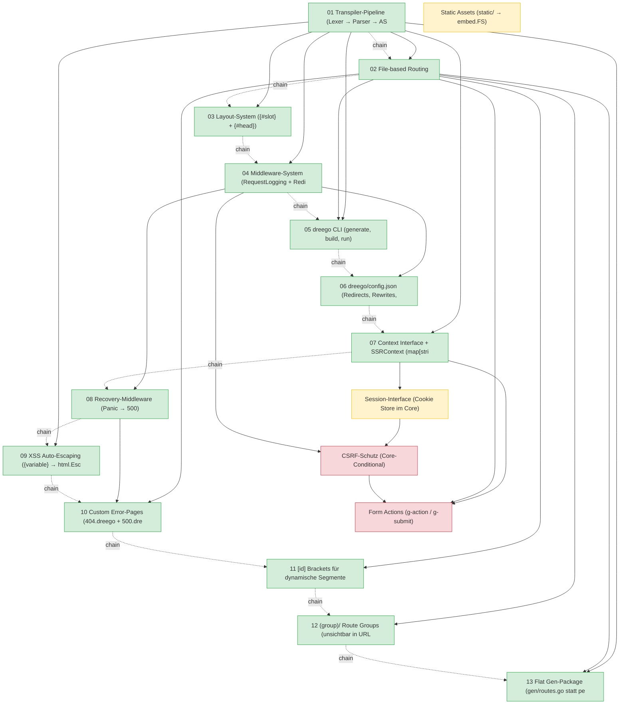

```mermaid
graph TD
    transpiler_1["01 Transpiler-Pipeline (Lexer → Parser → AS"]
    style transpiler_1 fill:#d4edda,stroke:#28a745
    routing_1["02 File-based Routing"]
    style routing_1 fill:#d4edda,stroke:#28a745
    layout_1["03 Layout-System ({#slot} + {#head})"]
    style layout_1 fill:#d4edda,stroke:#28a745
    middleware_1["04 Middleware-System (RequestLogging + Redi"]
    style middleware_1 fill:#d4edda,stroke:#28a745
    cli_1["05 dreego CLI (generate, build, run)"]
    style cli_1 fill:#d4edda,stroke:#28a745
    config_1["06 dreego/config.json (Redirects, Rewrites,"]
    style config_1 fill:#d4edda,stroke:#28a745
    context_refactoring_1["07 Context Interface + SSRContext (map[stri"]
    style context_refactoring_1 fill:#d4edda,stroke:#28a745
    recovery_1["08 Recovery-Middleware (Panic → 500)"]
    style recovery_1 fill:#d4edda,stroke:#28a745
    xss_1["09 XSS Auto-Escaping ({variable} → html.Esc"]
    style xss_1 fill:#d4edda,stroke:#28a745
    error_pages_1["10 Custom Error-Pages (404.dreego + 500.dre"]
    style error_pages_1 fill:#d4edda,stroke:#28a745
    bracket_routes_1["11 [id] Brackets für dynamische Segmente"]
    style bracket_routes_1 fill:#d4edda,stroke:#28a745
    route_groups_1["12 (group)/ Route Groups (unsichtbar in URL"]
    style route_groups_1 fill:#d4edda,stroke:#28a745
    flat_gen_1["13 Flat Gen-Package (gen/routes.go statt pe"]
    style flat_gen_1 fill:#d4edda,stroke:#28a745
    session_1["Session-Interface (Cookie Store im Core)"]
    style session_1 fill:#fff3cd,stroke:#ffc107
    static_assets_1["Static Assets (static/ → embed.FS)"]
    style static_assets_1 fill:#fff3cd,stroke:#ffc107
    csrf_1["CSRF-Schutz (Core-Conditional)"]
    style csrf_1 fill:#f8d7da,stroke:#dc3545
    form_actions_1["Form Actions (g-action / g-submit)"]
    style form_actions_1 fill:#f8d7da,stroke:#dc3545

    context_refactoring_1 --> form_actions_1
    routing_1 --> form_actions_1
    csrf_1 --> form_actions_1
    session_1 --> csrf_1
    middleware_1 --> csrf_1
    context_refactoring_1 --> session_1
    transpiler_1 --> flat_gen_1
    routing_1 --> flat_gen_1
    transpiler_1 --> context_refactoring_1
    transpiler_1 --> layout_1
    transpiler_1 --> middleware_1
    routing_1 --> route_groups_1
    middleware_1 --> recovery_1
    transpiler_1 --> routing_1
    routing_1 --> bracket_routes_1
    routing_1 --> error_pages_1
    recovery_1 --> error_pages_1
    transpiler_1 --> xss_1
    middleware_1 --> config_1
    transpiler_1 --> cli_1
    routing_1 --> cli_1

    transpiler_1 -.->|chain| routing_1
    routing_1 -.->|chain| layout_1
    layout_1 -.->|chain| middleware_1
    middleware_1 -.->|chain| cli_1
    cli_1 -.->|chain| config_1
    config_1 -.->|chain| context_refactoring_1
    context_refactoring_1 -.->|chain| recovery_1
    recovery_1 -.->|chain| xss_1
    xss_1 -.->|chain| error_pages_1
    error_pages_1 -.->|chain| bracket_routes_1
    bracket_routes_1 -.->|chain| route_groups_1
    route_groups_1 -.->|chain| flat_gen_1
```
