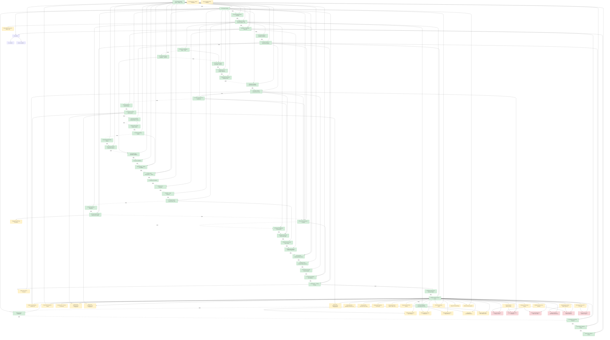

```mermaid
graph TD
    transpiler_1["01 Transpiler Pipeline (Lexer → Parser → AS"]
    style transpiler_1 fill:#d4edda,stroke:#28a745
    routing_1["02 File-based Routing"]
    style routing_1 fill:#d4edda,stroke:#28a745
    layout_1["03 Layout System ({#slot} + {#head})"]
    style layout_1 fill:#d4edda,stroke:#28a745
    middleware_1["04 Middleware System (RequestLogging + Redi"]
    style middleware_1 fill:#d4edda,stroke:#28a745
    cli_1["05 dreego CLI (generate, build, run)"]
    style cli_1 fill:#d4edda,stroke:#28a745
    config_1["06 dreego/config.json (Redirects, Rewrites,"]
    style config_1 fill:#d4edda,stroke:#28a745
    context_refactoring_1["07 Context Interface + SSRContext (map[stri"]
    style context_refactoring_1 fill:#d4edda,stroke:#28a745
    recovery_1["08 Recovery Middleware (Panic → 500)"]
    style recovery_1 fill:#d4edda,stroke:#28a745
    xss_1["09 XSS Auto-Escaping ({variable} → html.Esc"]
    style xss_1 fill:#d4edda,stroke:#28a745
    error_pages_1["10 Custom Error Pages (404.dreego + 500.dre"]
    style error_pages_1 fill:#d4edda,stroke:#28a745
    bracket_routes_1["11 [id] Brackets for Dynamic Segments"]
    style bracket_routes_1 fill:#d4edda,stroke:#28a745
    route_groups_1["12 (group)/ Route Groups (invisible in URL)"]
    style route_groups_1 fill:#d4edda,stroke:#28a745
    flat_gen_1["13 Flat Gen Package (gen/routes.go instead "]
    style flat_gen_1 fill:#d4edda,stroke:#28a745
    session_1["14 Session Interface (Cookie Store in Core)"]
    style session_1 fill:#d4edda,stroke:#28a745
    csrf_1["15 CSRF Protection (Core-Conditional)"]
    style csrf_1 fill:#d4edda,stroke:#28a745
    ci_check_1["16 dreego generate --check (CI Mode)"]
    style ci_check_1 fill:#d4edda,stroke:#28a745
    components_1["17 Component System ({#use}, props)"]
    style components_1 fill:#d4edda,stroke:#28a745
    component_handler_1["18 ComponentHandler (Buffered Mode + Functi"]
    style component_handler_1 fill:#d4edda,stroke:#28a745
    named_slots_1["19 Named Slots ({#slot header}...{/slot})"]
    style named_slots_1 fill:#d4edda,stroke:#28a745
    each_loop_1["20 {#each} with $loop variable"]
    style each_loop_1 fill:#d4edda,stroke:#28a745
    verbatim_1["21 {#verbatim} Block (Raw-Output)"]
    style verbatim_1 fill:#d4edda,stroke:#28a745
    tag_prefix_fix_1["22 scanTag: Tag Prefix Matching Fix (head v"]
    style tag_prefix_fix_1 fill:#d4edda,stroke:#28a745
    template_filters_1["23 Template Filters ({var|raw}, {var|upper}"]
    style template_filters_1 fill:#d4edda,stroke:#28a745
    if_else_1["24 {#else} in {#if}-Block"]
    style if_else_1 fill:#d4edda,stroke:#28a745
    each_else_1["25 {#each else} — Empty List Fallback"]
    style each_else_1 fill:#d4edda,stroke:#28a745
    static_assets_1["26 Static Assets (dreego/static/ → inline H"]
    style static_assets_1 fill:#d4edda,stroke:#28a745
    dreego_fmt_1["27 dreego fmt (Formatter)"]
    style dreego_fmt_1 fill:#d4edda,stroke:#28a745
    scaffolding_1["28 dreego new + Generators"]
    style scaffolding_1 fill:#d4edda,stroke:#28a745
    health_checks_1["29 /health + /ready Endpoints"]
    style health_checks_1 fill:#d4edda,stroke:#28a745
    security_headers_1["30 Security Headers (nosniff, frame, referr"]
    style security_headers_1 fill:#d4edda,stroke:#28a745
    compression_1["31 Gzip Compression Middleware"]
    style compression_1 fill:#d4edda,stroke:#28a745
    api_json_1["32 Content-Type Routing (JSON, XML, Custom)"]
    style api_json_1 fill:#d4edda,stroke:#28a745
    form_actions_1["33 Form Actions (g-action / g-submit)"]
    style form_actions_1 fill:#d4edda,stroke:#28a745
    request_id_1["34 Request-ID Middleware (X-Request-ID)"]
    style request_id_1 fill:#d4edda,stroke:#28a745
    security_cookie_1["35 Harden Session and CSRF Cookie Flags"]
    style security_cookie_1 fill:#d4edda,stroke:#28a745
    security_csp_1["36 Add Content-Security-Policy Header"]
    style security_csp_1 fill:#d4edda,stroke:#28a745
    deployment_1["37 Deployment Strategy (Docker, Single-Bina"]
    style deployment_1 fill:#d4edda,stroke:#28a745
    servemux_cache_1["38 Cache Built Middleware/Router Stack"]
    style servemux_cache_1 fill:#d4edda,stroke:#28a745
    codegen_errors_1["39 Replace Silent CodeGen Failures with Err"]
    style codegen_errors_1 fill:#d4edda,stroke:#28a745
    security_session_1["40 Document or Encrypt Session Payload"]
    style security_session_1 fill:#d4edda,stroke:#28a745
    typed_forms_1["41 Typed Form Binding and Validation"]
    style typed_forms_1 fill:#d4edda,stroke:#28a745
    dreegotest_1["42 dreegotest — Testing Package"]
    style dreegotest_1 fill:#d4edda,stroke:#28a745
    golden_tests_core_1["43 Golden Code Tests for Generator Output"]
    style golden_tests_core_1 fill:#d4edda,stroke:#28a745
    plugin_interface_1["44 Plugin Interface (Frozen for v1)"]
    style plugin_interface_1 fill:#d4edda,stroke:#28a745
    middleware_hooks_1["45 Plugin Middleware Hooks (app.Use FIFO)"]
    style middleware_hooks_1 fill:#d4edda,stroke:#28a745
    route_hooks_1["46 Plugin Route Registration"]
    style route_hooks_1 fill:#d4edda,stroke:#28a745
    docs_extensibility_1["47 Extensible dreego docs Command"]
    style docs_extensibility_1 fill:#d4edda,stroke:#28a745
    frontmatter_1["48 Frontmatter Support in .dreego"]
    style frontmatter_1 fill:#d4edda,stroke:#28a745
    dev_server_1["49 Dev Server with Hot Reload"]
    style dev_server_1 fill:#d4edda,stroke:#28a745
    addon_ecosystem_1["Addon Ecosystem (auth, ui, admin, db)"]
    style addon_ecosystem_1 fill:#fff3cd,stroke:#ffc107
    api_swagger_1["Swagger/OpenAPI Auto-Generation"]
    style api_swagger_1 fill:#fff3cd,stroke:#ffc107
    cache_interface_1["Caching Interface (Memory, Redis)"]
    style cache_interface_1 fill:#fff3cd,stroke:#ffc107
    client_reactivity_1["Client-Side Reactivity for .dreego"]
    style client_reactivity_1 fill:#fff3cd,stroke:#ffc107
    ddos_protection_1["DDoS Protection (PoW + Rate-Limiting) — "]
    style ddos_protection_1 fill:#fff3cd,stroke:#ffc107
    devtools_1["DevTools (LSP, VS Code, CLI-Niceties)"]
    style devtools_1 fill:#fff3cd,stroke:#ffc107
    documentation_1["docs.dreego.dev + Tutorial + Examples"]
    style documentation_1 fill:#fff3cd,stroke:#ffc107
    dreego_analytics_1["dreego-analytics (Privacy-friendly, Serv"]
    style dreego_analytics_1 fill:#fff3cd,stroke:#ffc107
    dreego_charts_1["dreego-charts (Chart.js/Canvas Component"]
    style dreego_charts_1 fill:#fff3cd,stroke:#ffc107
    dreego_features_1["dreego-features (Feature-Flags, A/B-Test"]
    style dreego_features_1 fill:#fff3cd,stroke:#ffc107
    dreego_feedback_1["dreego feedback (POST endpoint)"]
    style dreego_feedback_1 fill:#fff3cd,stroke:#ffc107
    dreego_i18n_1["dreego-i18n (Internationalization)"]
    style dreego_i18n_1 fill:#fff3cd,stroke:#ffc107
    dreego_icons_1["dreego-icons (Lucide/Heroicons Component"]
    style dreego_icons_1 fill:#fff3cd,stroke:#ffc107
    dreego_map_1["dreego-map (MapLibre/Leaflet Components)"]
    style dreego_map_1 fill:#fff3cd,stroke:#ffc107
    dreego_markdown_1["dreego-markdown (Markdown Rendering, Fro"]
    style dreego_markdown_1 fill:#fff3cd,stroke:#ffc107
    dreego_pdf_1["dreego-pdf (PDF Generation from HTML)"]
    style dreego_pdf_1 fill:#fff3cd,stroke:#ffc107
    dreego_polar_1["dreego-polar (Payments via Polar.sh)"]
    style dreego_polar_1 fill:#fff3cd,stroke:#ffc107
    dreego_pwa_1["dreego-pwa (Service Worker, Offline-Cach"]
    style dreego_pwa_1 fill:#fff3cd,stroke:#ffc107
    dreego_search_1["dreego-search (Full-Text Search)"]
    style dreego_search_1 fill:#fff3cd,stroke:#ffc107
    dreego_seo_1["dreego-seo (Meta-Tags, OG, JSON-LD, Site"]
    style dreego_seo_1 fill:#fff3cd,stroke:#ffc107
    email_interface_1["Email Sending Interface (SMTP, Resend, P"]
    style email_interface_1 fill:#fff3cd,stroke:#ffc107
    event_bus_1["Pub/Sub Event Bus (Core Interface)"]
    style event_bus_1 fill:#fff3cd,stroke:#ffc107
    golden_tests_1["Golden File Tests for Generator"]
    style golden_tests_1 fill:#fff3cd,stroke:#ffc107
    observability_1["Observability (Request-ID, Metrics, Trac"]
    style observability_1 fill:#fff3cd,stroke:#ffc107
    queue_interface_1["Background Job Queue Interface"]
    style queue_interface_1 fill:#fff3cd,stroke:#ffc107
    ssg_1["Static Site Generation (SSG)"]
    style ssg_1 fill:#fff3cd,stroke:#ffc107
    storage_interface_1["File Storage Interface (S3, R2, Local)"]
    style storage_interface_1 fill:#fff3cd,stroke:#ffc107
    tailwind_plugin_1["Tailwind CSS Build Plugin"]
    style tailwind_plugin_1 fill:#fff3cd,stroke:#ffc107
    wails_1["Wails Desktop Integration"]
    style wails_1 fill:#fff3cd,stroke:#ffc107
    dreego_cache_1["dreego-cache (Caching: Memory, Redis)"]
    style dreego_cache_1 fill:#f8d7da,stroke:#dc3545
    dreego_cluster_1["dreego-cluster (Multi-Node, Distributed "]
    style dreego_cluster_1 fill:#f8d7da,stroke:#dc3545
    dreego_jobs_1["dreego-jobs (Background Jobs, Cron, Queu"]
    style dreego_jobs_1 fill:#f8d7da,stroke:#dc3545
    dreego_mail_1["dreego-mail (Email SMTP/Resend/Postmark)"]
    style dreego_mail_1 fill:#f8d7da,stroke:#dc3545
    dreego_notify_1["dreego-notify (Multi-Channel Notificatio"]
    style dreego_notify_1 fill:#f8d7da,stroke:#dc3545
    dreego_storage_1["dreego-storage (File Uploads, Progress, "]
    style dreego_storage_1 fill:#f8d7da,stroke:#dc3545

    api_json_1 --> api_swagger_1
    plugin_interface_1 --> dreego_mail_1
    email_interface_1 --> dreego_mail_1
    plugin_interface_1 --> dreego_map_1
    components_1 --> dreego_map_1
    plugin_interface_1 --> dreego_icons_1
    components_1 --> dreego_icons_1
    plugin_interface_1 --> dreego_storage_1
    storage_interface_1 --> dreego_storage_1
    plugin_interface_1 --> dreego_seo_1
    middleware_hooks_1 --> dreego_seo_1
    plugin_interface_1 --> devtools_1
    plugin_interface_1 --> storage_interface_1
    cli_1 --> hot_reload_1
    routing_1 --> hot_reload_1
    plugin_interface_1 --> dreego_jobs_1
    queue_interface_1 --> dreego_jobs_1
    plugin_interface_1 --> dreego_pdf_1
    routing_1 --> ssg_1
    plugin_interface_1 --> ssg_1
    plugin_interface_1 --> dreego_cluster_1
    session_1 --> dreego_cluster_1
    cache_interface_1 --> dreego_cluster_1
    event_bus_1 --> dreego_cluster_1
    transpiler_1 --> golden_tests_1
    dreegotest_1 --> golden_tests_1
    plugin_interface_1 --> dreego_charts_1
    components_1 --> dreego_charts_1
    plugin_interface_1 --> dreego_notify_1
    email_interface_1 --> dreego_notify_1
    event_bus_1 --> dreego_notify_1
    hot_reload_1 --> live_reload_1
    plugin_interface_1 --> dreego_analytics_1
    middleware_hooks_1 --> dreego_analytics_1
    plugin_interface_1 --> email_interface_1
    plugin_interface_1 --> dreego_polar_1
    plugin_interface_1 --> queue_interface_1
    plugin_interface_1 --> addon_ecosystem_1
    components_1 --> addon_ecosystem_1
    session_1 --> addon_ecosystem_1
    plugin_interface_1 --> event_bus_1
    routing_1 --> wails_1
    plugin_interface_1 --> wails_1
    plugin_interface_1 --> client_reactivity_1
    transpiler_1 --> client_reactivity_1
    plugin_interface_1 --> dreego_features_1
    middleware_hooks_1 --> dreego_features_1
    plugin_interface_1 --> dreego_cache_1
    cache_interface_1 --> dreego_cache_1
    plugin_interface_1 --> dreego_i18n_1
    middleware_hooks_1 --> dreego_i18n_1
    plugin_interface_1 --> dreego_search_1
    plugin_interface_1 --> ddos_protection_1
    middleware_hooks_1 --> ddos_protection_1
    plugin_interface_1 --> dreego_pwa_1
    plugin_interface_1 --> dreego_markdown_1
    plugin_interface_1 --> cache_interface_1
    plugin_interface_1 --> tailwind_plugin_1
    hot_reload_1 --> smart_recompile_1
    middleware_1 --> observability_1
    middleware_1 --> security_headers_1
    middleware_1 --> compression_1
    dreegotest_1 --> golden_tests_core_1
    transpiler_1 --> flat_gen_1
    routing_1 --> flat_gen_1
    transpiler_1 --> context_refactoring_1
    transpiler_1 --> layout_1
    middleware_1 --> request_id_1
    transpiler_1 --> middleware_1
    routing_1 --> components_1
    security_headers_1 --> security_csp_1
    routing_1 --> route_groups_1
    transpiler_1 --> dev_server_1
    cli_1 --> dev_server_1
    transpiler_1 --> each_loop_1
    transpiler_1 --> if_else_1
    transpiler_1 --> tag_prefix_fix_1
    middleware_1 --> recovery_1
    transpiler_1 --> codegen_errors_1
    middleware_1 --> servemux_cache_1
    routing_1 --> servemux_cache_1
    form_actions_1 --> typed_forms_1
    transpiler_1 --> typed_forms_1
    plugin_interface_1 --> middleware_hooks_1
    middleware_1 --> middleware_hooks_1
    transpiler_1 --> routing_1
    routing_1 --> dreegotest_1
    context_refactoring_1 --> dreegotest_1
    routing_1 --> bracket_routes_1
    context_refactoring_1 --> plugin_interface_1
    middleware_1 --> plugin_interface_1
    transpiler_1 --> static_assets_1
    routing_1 --> static_assets_1
    context_refactoring_1 --> form_actions_1
    routing_1 --> form_actions_1
    csrf_1 --> form_actions_1
    session_1 --> form_actions_1
    component_handler_1 --> named_slots_1
    routing_1 --> error_pages_1
    recovery_1 --> error_pages_1
    session_1 --> csrf_1
    middleware_1 --> csrf_1
    transpiler_1 --> each_else_1
    each_loop_1 --> each_else_1
    transpiler_1 --> xss_1
    transpiler_1 --> template_filters_1
    xss_1 --> template_filters_1
    routing_1 --> api_json_1
    context_refactoring_1 --> api_json_1
    cli_1 --> docs_extensibility_1
    plugin_interface_1 --> docs_extensibility_1
    transpiler_1 --> verbatim_1
    transpiler_1 --> dreego_fmt_1
    context_refactoring_1 --> session_1
    session_1 --> security_cookie_1
    csrf_1 --> security_cookie_1
    session_1 --> security_session_1
    cli_1 --> deployment_1
    context_refactoring_1 --> component_handler_1
    middleware_1 --> config_1
    plugin_interface_1 --> route_hooks_1
    routing_1 --> route_hooks_1
    cli_1 --> ci_check_1
    transpiler_1 --> frontmatter_1
    context_refactoring_1 --> frontmatter_1
    cli_1 --> scaffolding_1
    transpiler_1 --> cli_1
    routing_1 --> cli_1
    routing_1 --> health_checks_1

    transpiler_1 -.->|chain| routing_1
    routing_1 -.->|chain| layout_1
    layout_1 -.->|chain| middleware_1
    middleware_1 -.->|chain| cli_1
    cli_1 -.->|chain| config_1
    config_1 -.->|chain| context_refactoring_1
    context_refactoring_1 -.->|chain| recovery_1
    recovery_1 -.->|chain| xss_1
    xss_1 -.->|chain| error_pages_1
    error_pages_1 -.->|chain| bracket_routes_1
    bracket_routes_1 -.->|chain| route_groups_1
    route_groups_1 -.->|chain| flat_gen_1
    flat_gen_1 -.->|chain| session_1
    session_1 -.->|chain| csrf_1
    csrf_1 -.->|chain| ci_check_1
    ci_check_1 -.->|chain| components_1
    components_1 -.->|chain| component_handler_1
    component_handler_1 -.->|chain| named_slots_1
    named_slots_1 -.->|chain| each_loop_1
    each_loop_1 -.->|chain| verbatim_1
    verbatim_1 -.->|chain| tag_prefix_fix_1
    tag_prefix_fix_1 -.->|chain| template_filters_1
    template_filters_1 -.->|chain| if_else_1
    if_else_1 -.->|chain| each_else_1
    each_else_1 -.->|chain| static_assets_1
    static_assets_1 -.->|chain| dreego_fmt_1
    dreego_fmt_1 -.->|chain| scaffolding_1
    scaffolding_1 -.->|chain| health_checks_1
    health_checks_1 -.->|chain| security_headers_1
    security_headers_1 -.->|chain| compression_1
    compression_1 -.->|chain| api_json_1
    api_json_1 -.->|chain| form_actions_1
    form_actions_1 -.->|chain| request_id_1
    request_id_1 -.->|chain| security_cookie_1
    security_cookie_1 -.->|chain| security_csp_1
    security_csp_1 -.->|chain| deployment_1
    deployment_1 -.->|chain| servemux_cache_1
    servemux_cache_1 -.->|chain| codegen_errors_1
    codegen_errors_1 -.->|chain| security_session_1
    security_session_1 -.->|chain| typed_forms_1
    typed_forms_1 -.->|chain| dreegotest_1
    dreegotest_1 -.->|chain| golden_tests_core_1
    golden_tests_core_1 -.->|chain| plugin_interface_1
    plugin_interface_1 -.->|chain| middleware_hooks_1
    middleware_hooks_1 -.->|chain| route_hooks_1
    route_hooks_1 -.->|chain| docs_extensibility_1
    docs_extensibility_1 -.->|chain| frontmatter_1
    frontmatter_1 -.->|chain| dev_server_1
```
